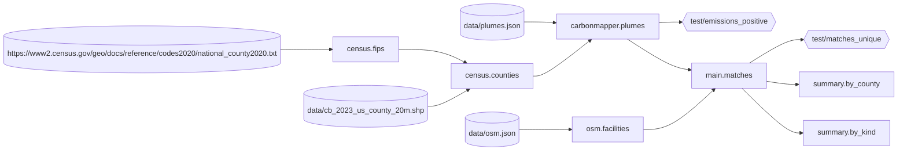

# Example: methane plumes and oil and gas infrastructure

This project matches methane plumes over New Mexico from
[Carbon Mapper](https://carbonmapper.org/) to the nearest oil and gas facility
in [OpenStreetMap](https://www.openstreetmap.org/), and summarises the matches
by facility type and county. All inputs are fetched live from public sources.

```sh
make             # fetch the data and build every table
make test        # run the tests
make shell       # query the tables in DuckDB
make RADIUS=100  # rebuild the matches with a 100 m search radius
```

The first run takes a few minutes. Delete `data/` to fetch the data again.

```
.
├── Makefile                      # fetches the files in data/
├── queries/osm.overpassql        # OpenStreetMap query
├── macros/
│   ├── geo.sql                   # metres(): great-circle distance
│   └── spatial.sql               # loads the spatial extension
├── models/
│   ├── census/fips.sql           # county codes, read from a URL
│   ├── census/counties.sql       # county boundaries
│   ├── carbonmapper/plumes.sql   # plumes within New Mexico
│   ├── osm/facilities.sql        # mapped oil and gas facilities
│   ├── matches.sql               # nearest facility within RADIUS metres
│   ├── summary/by_kind.sql
│   └── summary/by_county.sql
└── tests/
    ├── emissions_positive.sql
    └── matches_unique.sql
```

`build/dag.mmd` holds the dependency graph:


